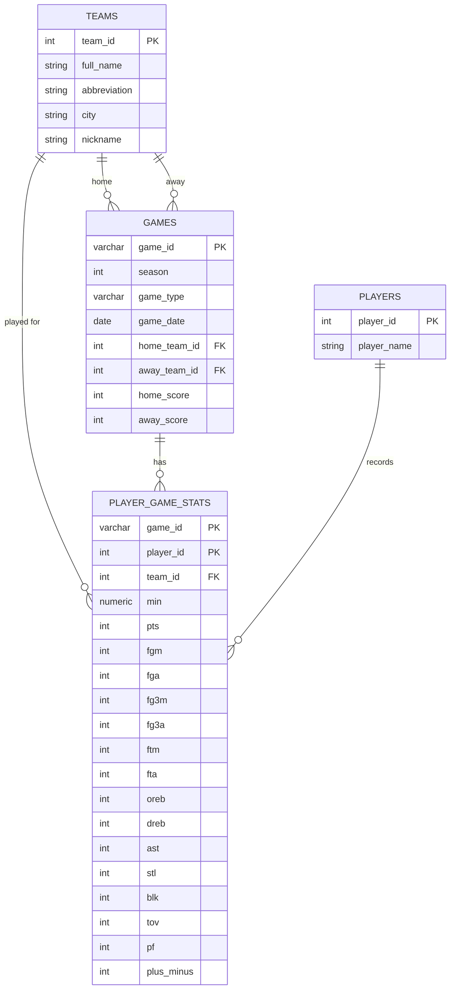

# 82 Boxes ERD (v1)
Diagram's types are general, exact SQL types are in sql/create_tables.sql.

```mermaid
erDiagram
  TEAMS ||--o{ GAMES : home
  TEAMS ||--o{ GAMES : away
  TEAMS ||--o{ PLAYER_GAME_STATS : "played for"
  GAMES ||--o{ PLAYER_GAME_STATS : has
  PLAYERS ||--o{ PLAYER_GAME_STATS : records
  TEAMS {
    int team_id PK
    string full_name
    string abbreviation
    string city
    string nickname
  }
  PLAYERS {
    int player_id PK
    string player_name
  }
  GAMES {
    varchar game_id PK
    int season
    varchar game_type
    date game_date
    int home_team_id FK
    int away_team_id FK
    int home_score
    int away_score
  }
  PLAYER_GAME_STATS {
    varchar game_id PK
    int player_id PK
    int team_id FK
    numeric min
    int pts
    int fgm
    int fga
    int fg3m
    int fg3a
    int ftm
    int fta
    int oreb
    int dreb
    int ast
    int stl
    int blk
    int tov
    int pf
    int plus_minus
  }
```