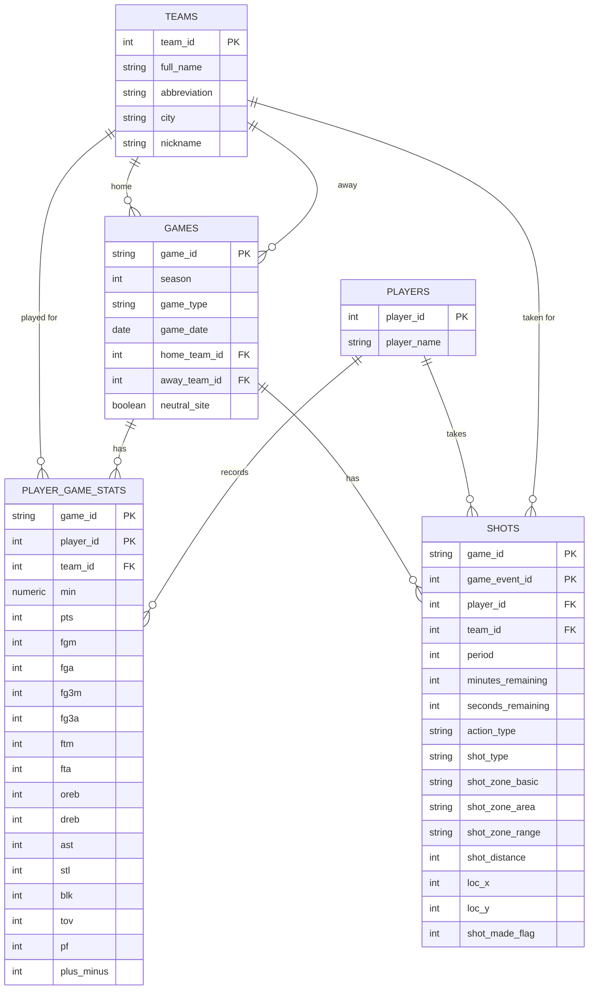

# 82 Boxes ERD 
Diagram's types are general, exact SQL types are in sql/create_tables.sql.

```mermaid
erDiagram
  TEAMS ||--o{ GAMES : home
  TEAMS ||--o{ GAMES : away
  TEAMS ||--o{ PLAYER_GAME_STATS : "played for"
  GAMES ||--o{ PLAYER_GAME_STATS : has
  PLAYERS ||--o{ PLAYER_GAME_STATS : records
  GAMES ||--o{ SHOTS : has
  PLAYERS ||--o{ SHOTS : takes
  TEAMS ||--o{ SHOTS : "taken for"
  TEAMS {
    int team_id PK
    string full_name
    string abbreviation
    string city
    string nickname
  }
  PLAYERS {
    int player_id PK
    string player_name
  }
  GAMES {
    string game_id PK
    int season
    string game_type
    date game_date
    int home_team_id FK
    int away_team_id FK
    boolean neutral_site
  }
  PLAYER_GAME_STATS {
    string game_id PK
    int player_id PK
    int team_id FK
    numeric min
    int pts
    int fgm
    int fga
    int fg3m
    int fg3a
    int ftm
    int fta
    int oreb
    int dreb
    int ast
    int stl
    int blk
    int tov
    int pf
    int plus_minus
  }
  SHOTS {
    string game_id PK
    int game_event_id PK
    int player_id FK
    int team_id FK
    int period
    int minutes_remaining
    int seconds_remaining
    string action_type
    string shot_type
    string shot_zone_basic
    string shot_zone_area
    string shot_zone_range
    int shot_distance
    int loc_x
    int loc_y
    int shot_made_flag
  }
```